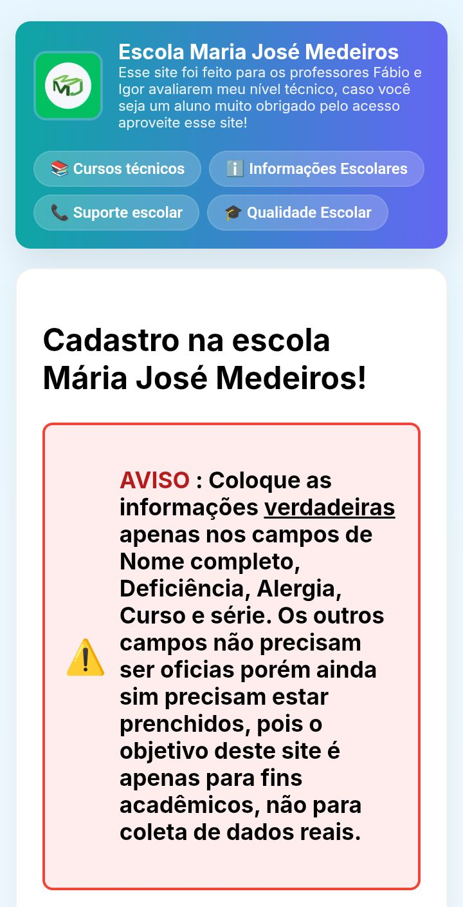
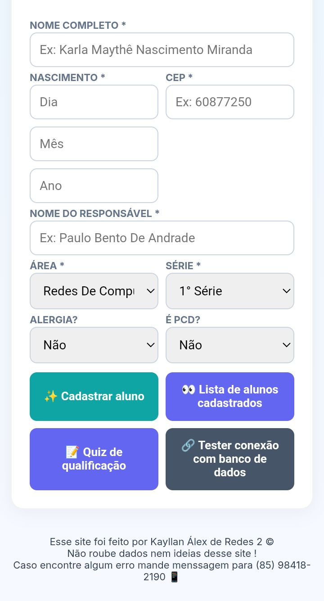
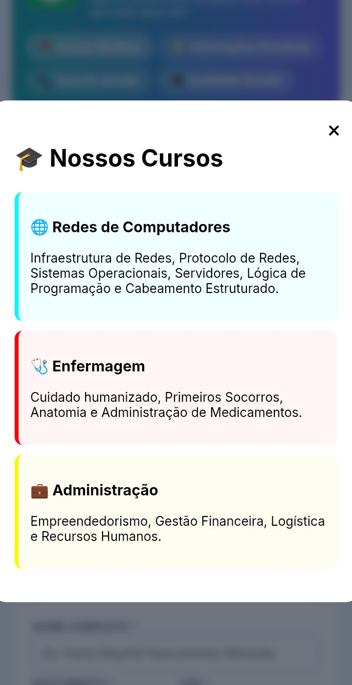
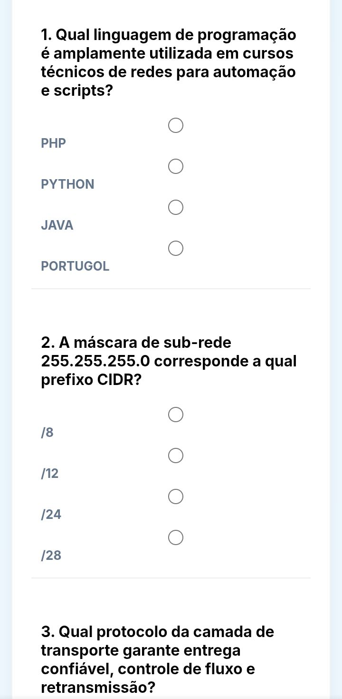

📚 Site da Escola Maria José Medeiros — projeto estudantil

Aviso: este é um projeto feito por um aluno, não é oficial. Foi desenvolvido apenas para avaliação técnica e fins de aprendizado.

🧩 Descrição do projeto

O site realiza o cadastro de alunos (coletando: nome, idade, nome do responsável, CEP, informação sobre alergias ou PCD, série e curso — Redes, Enfermagem ou Administração). Após o cadastro, o usuário pode realizar um quiz específico da sua área para avaliar o nível técnico e contribuir com métricas de qualidade escolar.
O projeto foi criado para que os professores mencionados possam avaliar meu nível de programação e para que eu (autor) treine e aplique conhecimentos de HTML, CSS e JavaScript na prática.

✅ Funcionalidades

Realizar cadastro de alunos (campos: nome, idade, responsavel, CEP, alergia/PCD, série, curso).

Exibir informações da escola.

Listar cursos e o que cada curso oferece.

Visualizar alunos cadastrados.

Aplicar quiz por área (Redes / Enfermagem / Administração).

Avaliação da qualidade escolar baseada nos resultados do quiz.

🛠 Tecnologias

Front-end: HTML, CSS, JavaScript

Back-end: Python

Banco de dados: Firebase

📂 Estrutura do projeto

siteMJM/
├── templates/
│   └── index.html
├── static/
│   ├── script.js
│   └── style.css
└── app.py

▶️ Como executar / acesso online

O projeto está publicado para demonstração em Replit:
https://maria-jose-medeiros--kaywzz.replit.app/

(Abra no navegador e teste o fluxo: cadastro → quiz → visualização de resultados.)

📸 Documentação / Imagens

  
  
  
  

🎯 Objetivo acadêmico

Este trabalho tem caráter avaliativo e formativo: serve para a avaliação técnica do curso, para demonstrar competências práticas em desenvolvimento web (HTML/CSS/JS) e backend em Python, e para aumentar as chances de obtenção de vagas de estágio ou atividades relacionadas a desenvolvimento na escola.

👥 Autor e créditos

Autor do código e responsável pelo desenvolvimento: Kayllan Álex de Assis Andrade

Professores para quem o projeto foi desenvolvido: Fábio e Igor

📄 Licença

Projeto disponibilizado sob a licença MIT. Consulte o arquivo LICENSE para detalhes.